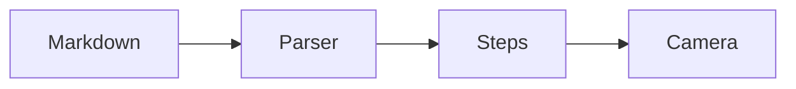

# Interactive Script Viewer
This ordinary Markdown file is rendered as a guided teaching canvas. The camera centers one block at a time so the class sees only the current idea.

Use **Arrow Right** or **Space** to move forward. Use **Arrow Left** to move backward. Press **M** to switch between step navigation and page navigation.

> Teaching prompt: ask learners what changes when a lesson moves from scrolling to a directed reading path.

## Core classroom experience
Every top-level heading, paragraph, list, blockquote, and code block becomes a targetable step.

The active step is centered and highlighted. In spotlight mode, inactive steps fade away so students are not distracted by the rest of the handout.

- Step mode advances through every block.
- Page mode jumps to the next major section, similar to turning a page in a comic reader.
- PageUp and PageDown always jump between major sections.

> Quick task: switch to page mode and compare the pacing with step mode.

## Responsive layout
The layout is intentionally mobile-first. Compact screens use a single vertical column because it preserves readability on laptops, tablets, and phones.

On wide displays, pages are arranged as an open-book spread. This gives the project a foundation for classroom monitors without changing how teachers write Markdown.

## Future plugins
The parser keeps the Markdown structure available as metadata, which makes future integrations straightforward.

```latex
\hat{f}(\xi) = \int_{-\infty}^{\infty} f(x) e^{-2\pi i x \xi} dx
```

KaTeX can later transform LaTeX blocks into scalable formulas while keeping the same step model.



Mermaid can later render diagrams directly from fenced code blocks.

## Package direction
The viewer is exported from `src/lib/index.ts` so the prototype can evolve into an npm package.

Consumers should provide Markdown and let the component own parsing, navigation, camera movement, and spotlight behavior.